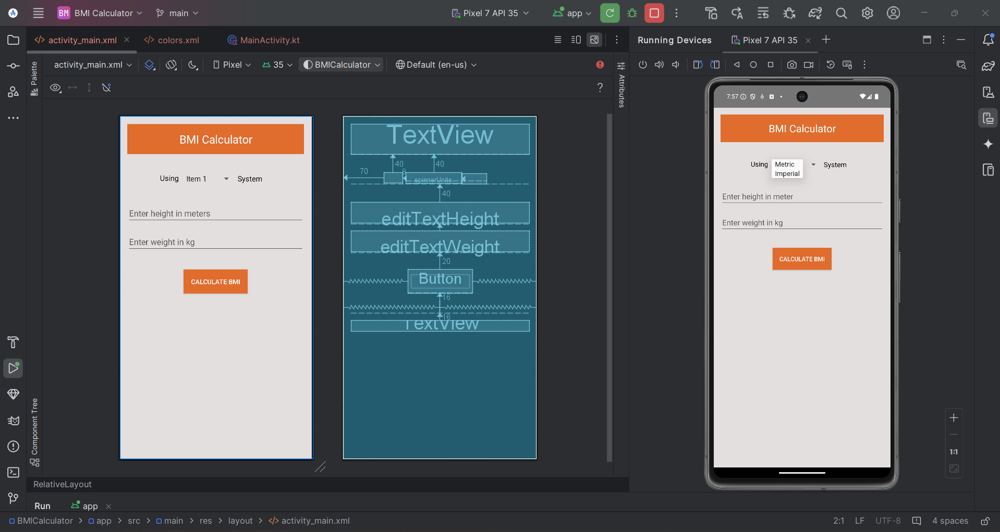
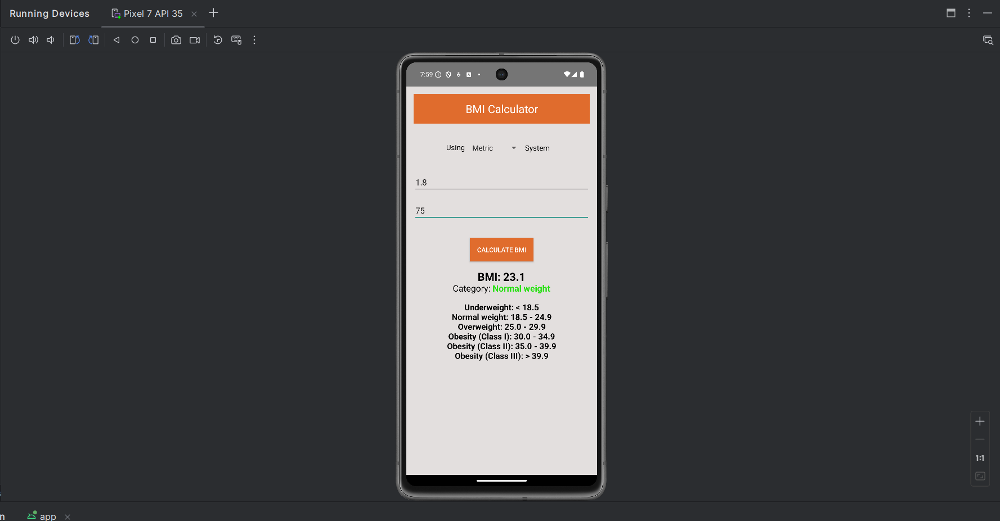
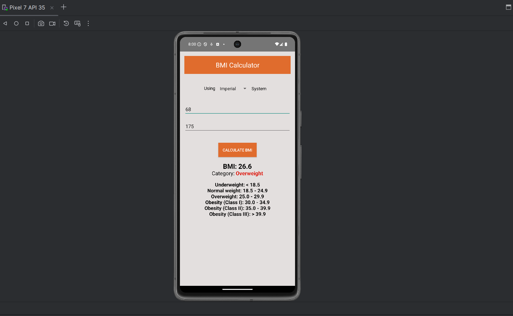

# BMI Calculator Android App

This Kotlin based Android application calculates BMI (Body Mass Index) based on user input for height and weight. It provides a classification of BMI into different weight categories such as Underweight, Normal weight, Overweight, and Obesity classes (I, II, III).

## Features

- Calculate BMI using metric (kg/m^2) or imperial (lb/in^2) units.
- Display BMI result and weight category.

## Design



## Output

BMI using Metric system


BMI using Imperial system


## Technologies Used
* Kotlin
* Android Studio
* XML

## Installation

Clone the repository and open the project in Android Studio.

```bash
git clone https://github.com/anik-dutta/kotlin_bmi-calculator.git
```

## Usage
1. Open the project in Android Studio.
2. Build and run the app on an emulator or physical device.

## How to Use
1. Select the unit system (metric or imperial).
2. Enter height and weight.
3. Click "Calculate BMI" button to get the BMI result and weight category.

